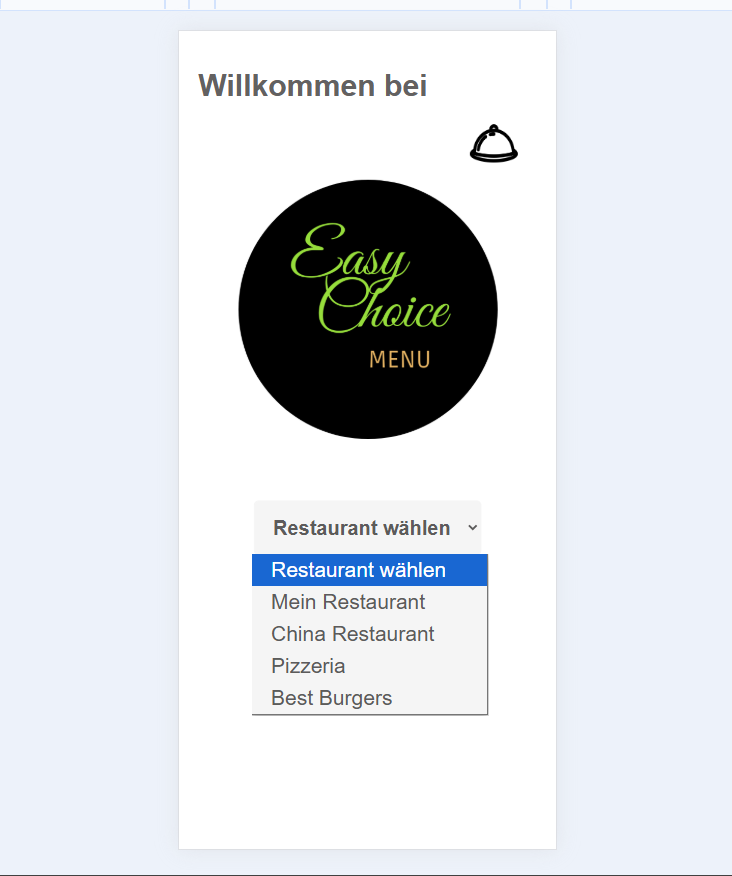
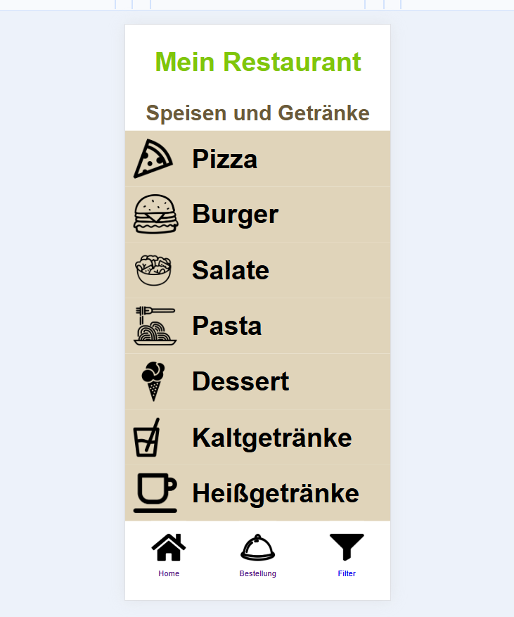
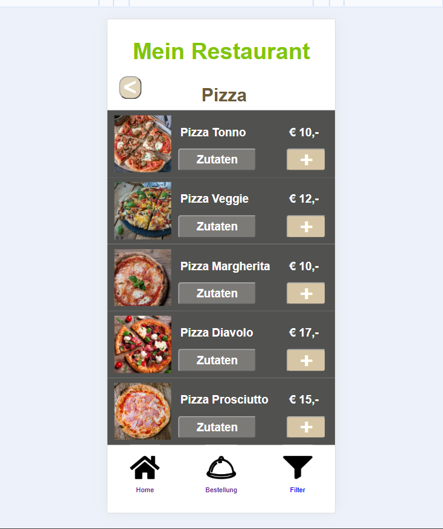
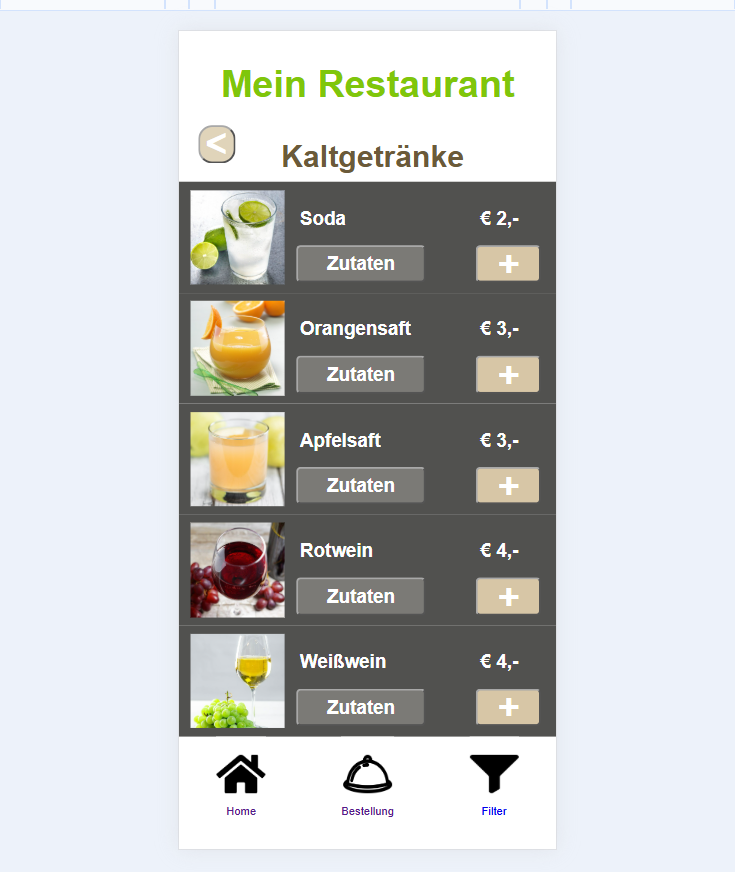
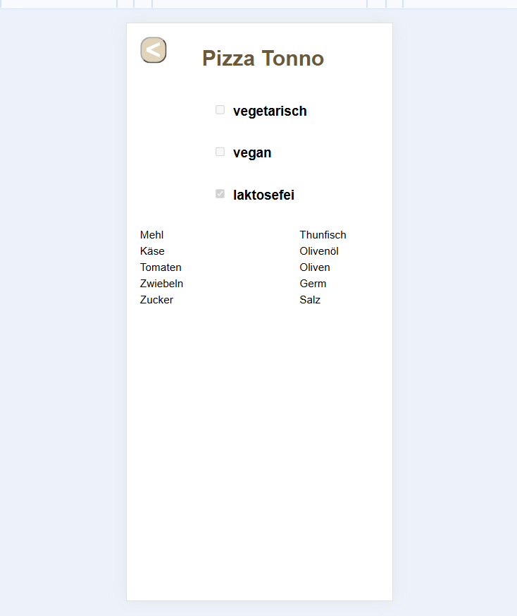
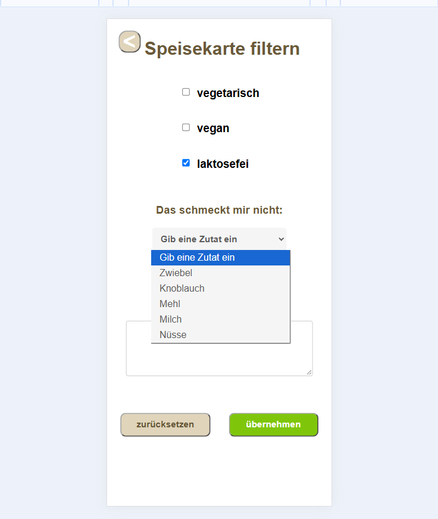
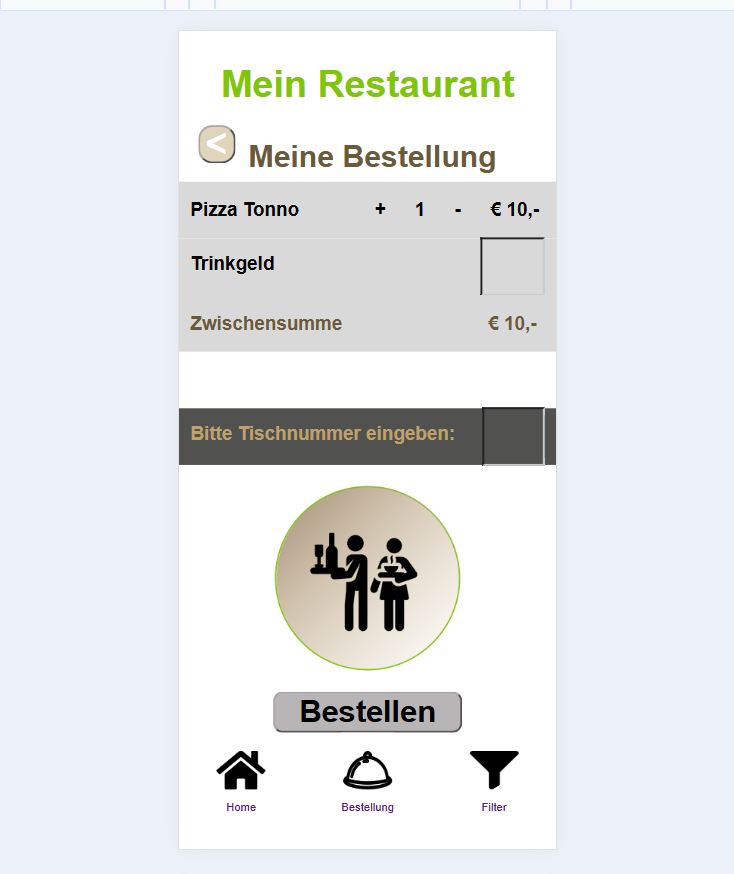

# EasyChoice PWA

Eine Progressive Web App zur Anzeige von Restaurantmenüs und zur Erstellung von Bestellungen.

Die Anwendung verfügt über eine für mobile Endgeräte optimierte Benutzeroberfläche mit intuitiven Bedienelementen, klarer Struktur und einer lebendigen, ansprechenden Farbgestaltung.

## Technologien

- HTML
- CSS
- JavaScript
- Web App Manifest
- Service Worker
- Web Worker

## Hauptfunktionen

- Auswahl verschiedener Restaurants
- Navigation durch Speise- und Getränkekategorien
- Produktübersicht mit Bildern und Preisen
- Detaillierte Informationen zu Zutaten einzelner Produkte
- Angaben zu Ernährungsmerkmalen wie vegetarisch, vegan und laktosefrei
- Filterung des Menüs nach Ernährungspräferenzen und unerwünschten Zutaten
- Hinzufügen von Produkten zu einer Bestellung
- Bestellübersicht mit Mengenanpassung und Zwischensumme
- Eingabe von Tischnummer und Trinkgeld
- Navigation zwischen Home, Bestellung und Filter

## PWA & Benutzeroberfläche

Die Anwendung wurde als Progressive Web App mit einer für mobile Endgeräte optimierten Benutzeroberfläche entwickelt.

Ein Web App Manifest und ein Service Worker bilden die technische Grundlage der PWA-Funktionalität.

Der Fokus der Benutzeroberfläche liegt auf intuitiver Bedienung, touchfreundlichen Elementen, einer übersichtlichen Struktur und einer klaren visuellen Benutzerführung.

## Anwendungsübersicht

### Restaurantauswahl

Vor dem Aufrufen des Menüs kann eines von mehreren Restaurants ausgewählt werden.

### Menükategorien

Das Hauptmenü bietet direkten Zugriff auf verschiedene Speise- und Getränkekategorien.

### Produktübersicht

Produkte werden mit Bildern, Preisen und direktem Zugriff auf Informationen zu den Zutaten dargestellt.

### Getränke

Getränke werden in derselben für mobile Endgeräte optimierten Produktansicht mit Bildern und Preisen dargestellt.

### Produktdetails

Die Detailansicht zeigt Informationen zu den Zutaten sowie zu verschiedenen Ernährungsmerkmalen.

### Menüfilter

Das Menü kann anhand von Ernährungspräferenzen und ausgewählten Zutaten gefiltert werden.

### Bestellung

Ausgewählte Produkte werden in einer Bestellübersicht gesammelt, in der Mengen sowie weitere Bestellinformationen angepasst werden können.

## GitHub

Quellcode und weitere Projektdetails sind hier verfügbar:

https://github.com/vlasdana/easychoice-pwa

## Autorin

Dana-Monica Vlas

## Über das Projekt

Hochschulprojekt, entwickelt im Rahmen meines Studiums an der FH JOANNEUM.
